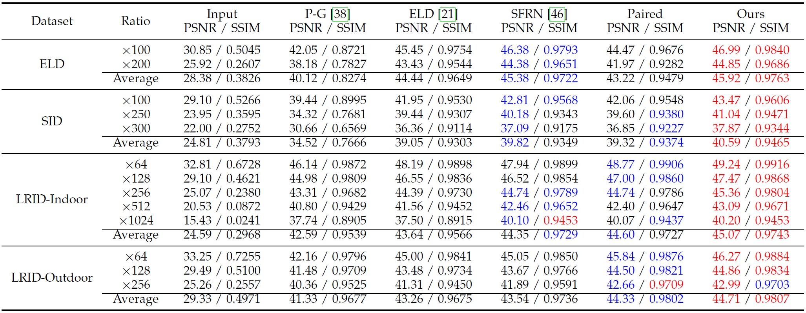
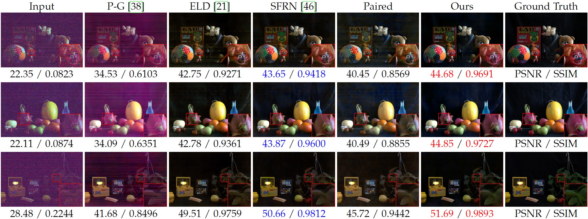
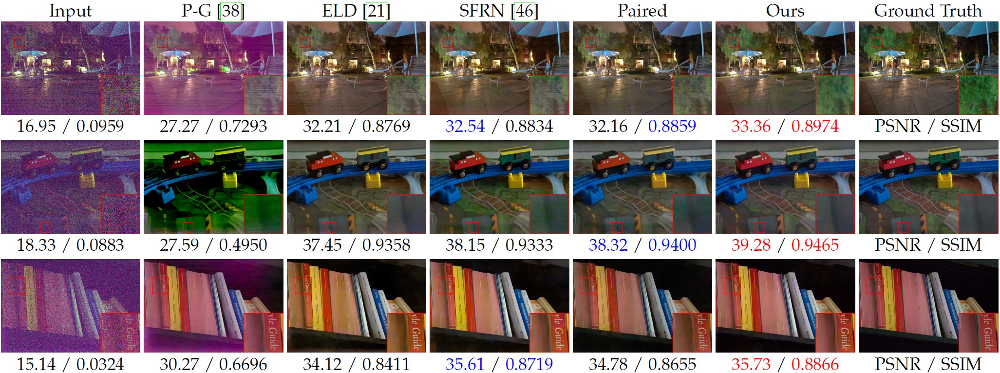
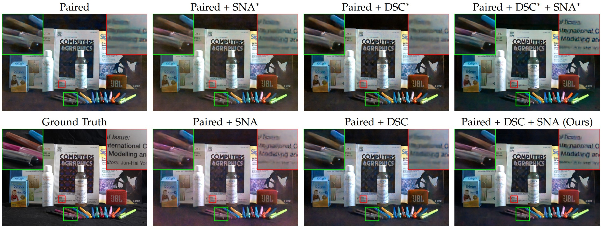
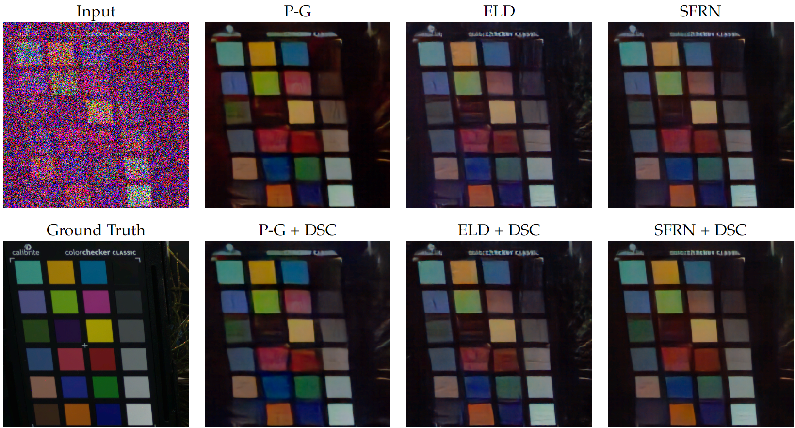

# PMN (TPAMI)

This work is based on our preliminary work "[Learnability Enhancement for Low-light Raw Denoising: Where Paired Real Data Meets Noise Modeling](https://github.com/megvii-research/PMN)" in ACMMM 2022.  
The checkpoints and resources are too large, so we upload them to the [Baidu Netdisk](https://pan.baidu.com/s/1YIY_bmrdK5SLfrHBQjWfRA?pwd=vmcl).

## 📋 TODO LIST

- [x] Checkout the main branch to TPAMI branch.  
- [x] Cleanup & update the code for the public datasets.  
- [x] Cleanup & update the code for our datasets.  
- [x] Test the the code for evaluation.  
- [ ] Test the the code for training.  

## ✨ Highlights
1. We light the idea of **learnability enhancement** for low-light raw image denoising by reforming paired real data according to the noise modeling from a data perspective.
<div align=center></div>

2. We increase the data volume of paired real data with a novel **Shot Noise Augmentation (SNA)** method, which promotes the precision of data mapping by data augmentation.
<div align=center></div>

3. We reduce the noise complexity with a novel **Dark Shading Correction (DSC)** method, which promotes the accuracy of data mapping by noise decoupling.
<div align=center></div>

4. We develop a high-quality **image acquisition protocol** and build a **Low-light Raw Image Denoising (LRID) dataset**, which promotes the reliability of data mapping by improving the data quality of paired real data.

<div align=center></div>


5. We demonstrate the superior performance of our methods on public datasets and our dataset in both quantitative results and visual quality.

## 📋 Prerequisites
* Python >=3.6, PyTorch >= 1.6
* Requirements: opencv-python, rawpy, exifread, h5py, scipy
* Platforms: Ubuntu 16.04, cuda-10.1
* Our method can run on the CPU, but we recommend you run it on the GPU

Please download the datasets first, which are necessary for validation (or training).   
ELD ([official project](https://github.com/Vandermode/ELD)): [download (11.46 GB)](https://drive.google.com/file/d/13Ge6-FY9RMPrvGiPvw7O4KS3LNfUXqEX/view?usp=sharing)  
SID ([official project](https://github.com/cchen156/Learning-to-See-in-the-Dark)):  [download (25 GB)](https://storage.googleapis.com/isl-datasets/SID/Sony.zip)  
LRID ([official project (with password) is released in the paper]):  [download (523 GB)](https://pan.baidu.com/s/1fXlb-Q_ofHOtVOufe5cwDg)

## 🎬 Quick Start
1. use `get_dataset_infos.py` to generate dataset infos (please modify `--root_dir`)
```bash 
# Evaluate
python3 get_dataset_infos.py --dstname ELD --root_dir /data/ELD --mode SonyA7S2
python3 get_dataset_infos.py --dstname SID --root_dir /data/SID/Sony --mode evaltest
python3 get_dataset_infos.py --dstname LRID --root_dir /data/LRID
# Train
python3 get_dataset_infos.py --dstname SID --root_dir /data/SID/Sony --mode train
# python3 get_dataset_infos.py --dstname LRID --root_dir /data/LRID
```
2. evaluate

If you don't want to save pictures, please add ```--save_plot False```. This option will save your time and space.
```bash 
# ELD & SID
python3 trainer_SID.py -f runfiles/SonyA7S2/Ours.yml --mode evaltest
# ELD only
python3 trainer_SID.py -f runfiles/SonyA7S2/Ours.yml --mode eval
# SID only
python3 trainer_SID.py -f runfiles/SonyA7S2/Ours.yml --mode test
# LRID
python3 trainer_LRID.py -f runfiles/IMX686/Ours.yml --mode evaltest
```
3. train
```bash 
# SID (SonyA7S2)
python3 trainer_SID.py -f runfiles/SonyA7S2/Ours.yml --mode train
# LRID (IMX686)
python3 trainer_LRID.py -f runfiles/IMX686/Ours.yml --mode train
```

## 🔍 Code Guidelines
#### SNA
The parameter sampling of SNA is implemented as the `SNA_torch` function in the file ```data_process/process.py```.
The complete process of SNA has the CPU version in the `Mix_Dataset` class in ```data_process/real_datasets.py``` and the GPU version in the `preprocess` function in ```trainer_SID.py```.
#### DSC
Both dark shading calibration and noise calibration require massive dark frames. We provide the calibration results directly. The calibration results for dark shading are stored in the `resources` folder.  
The raw noise parameters at each ISO are stored in the `get_camera_noisy_params_max` function in `process.py`, which can be used to calibrate the noise parameters based on a noise model (P-G or ELD).  

**HINT: The calibration is based on a SonyA7S2 camera, which has the same sensor as the public datasets but not the same camera.**

## 📄 Results

### Comparision


Note: 
* The quantitative results on the SID dataset is different from the provided results in ELD (TPAMI) because only the central area is compared in ELD (TPAMI) on the SID dataset.  
* We developed the implementation of SFRN and increased the number of dark frames, so its performance is much better than that in our preliminary version.

<details>
<summary>Visual Comparision</summary>

#### ELD

#### SID

#### Ours (LRID)

</details>

### Ablation Study

<details>
<summary>Visual Comparision</summary>


</details>

### Extension of DSC on Noise Modeling

<details>
<summary>Visual Comparision</summary>  


</details>

### Generalizability


## 🏷️ Citation
If you find our code helpful in your research or work please cite our paper.
```bibtex
@inproceedings{feng2022learnability,
    author = {Feng, Hansen and Wang, Lizhi and Wang, Yuzhi and Huang, Hua},
    title = {Learnability Enhancement for Low-Light Raw Denoising: Where Paired Real Data Meets Noise Modeling},
    booktitle = {Proceedings of the 30th ACM International Conference on Multimedia},
    year = {2022},
    pages = {1436–1444},
    numpages = {9},
    location = {Lisboa, Portugal},
    series = {MM '22}
}
```

## 🤝 Acknowledgments
* [SID (CVPR 2018)](https://github.com/cchen156/Learning-to-See-in-the-Dark)
* [ELD (CVPR 2020 / TPAMI 2021)](https://github.com/Vandermode/ELD)
* [SFRN (ICCV 2021)](https://github.com/zhangyi-3/noise-synthesis)

## 📧 Contact
If you would like to get in-depth help from me, please feel free to contact me (fenghansen@bit.edu.cn / hansen97@outlook.com) with a brief self-introduction (including your name, affiliation, and position).
